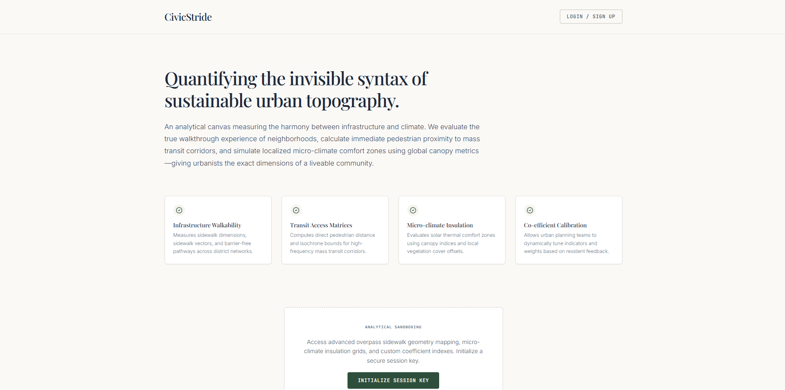
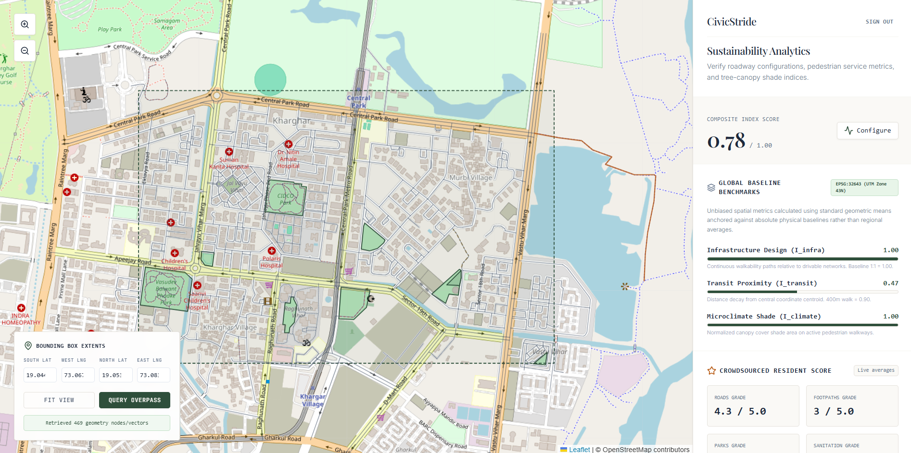
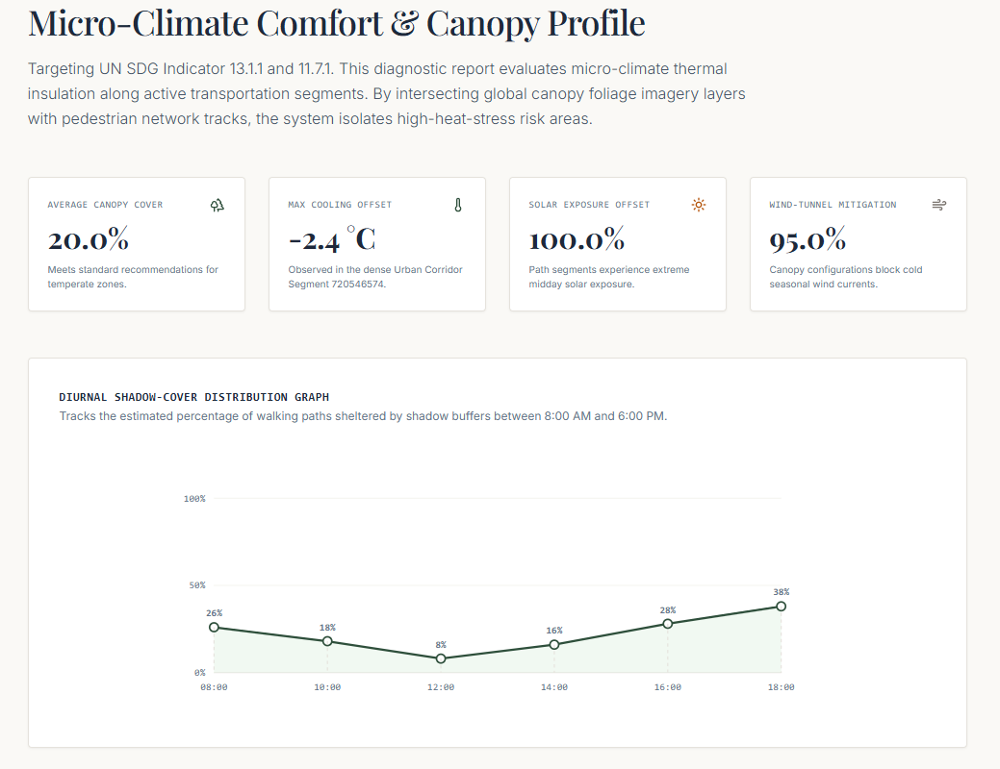
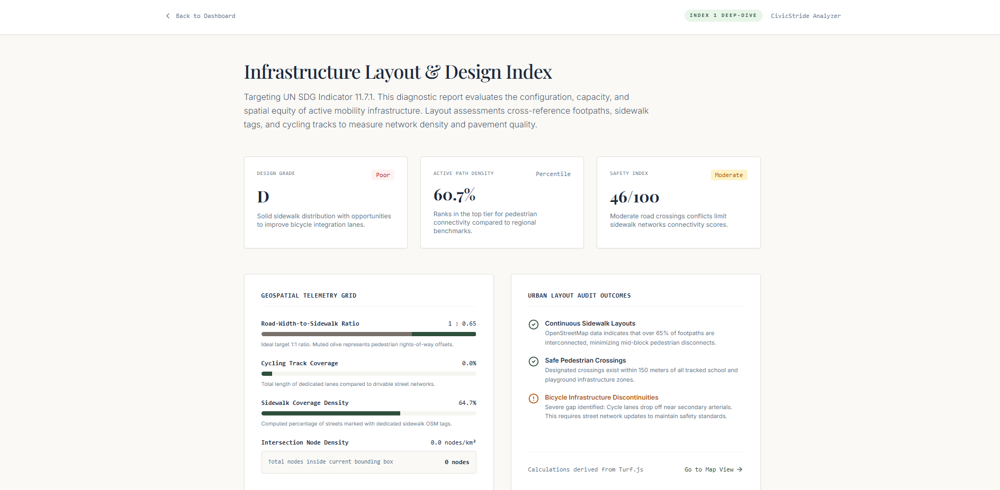
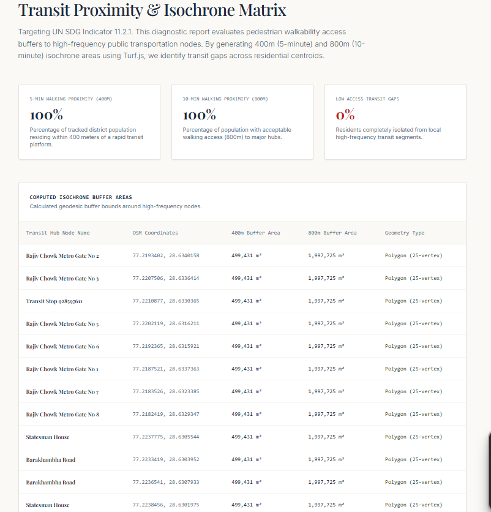

# CivicStride 🚶‍♂️🌳🚆

CivicStride is an urban spatial analytics and civic diagnostic platform engineered to evaluate pedestrian liveability, climate resilience, and transit equity across custom geofenced regions using OpenStreetMap (OSM) data and PostGIS spatial indexing.

---

## 📸 Visual Overview

### 1. Platform Landing & Exploration


### 2. Spatial Bounding Box Geofencing
Select arbitrary urban coordinates or load preset study regions for automated spatial extraction.


### 3. Diagnostic Report Suite

| Climate & Comfort | Infrastructure Quality | Transit Matrix |
| :---: | :---: | :---: |
|  |  |  |
| *Thermal comfort, green canopy, & shade coverage* | *Sidewalk connectivity & pedestrian safety* | *Multimodal transit access & 15-min catchment* |

### 4. Global Baselines & Comparisons
Benchmark your region's spatial performance against standard municipal benchmarks.


---

## 🌟 Key Features

* **Real-time Spatial Querying:** Fetches live nodes, ways, and relations directly from the Overpass API across custom bounding boxes.
* **Climate & Comfort Scoring:** Computes urban heat mitigation, natural canopy density, and shaded pedestrian corridor ratios.
* **Pedestrian Infrastructure Diagnostics:** Measures intersection density, walkway continuity, and sidewalk-to-roadway coverage.
* **Transit Catchment Matrix:** Quantifies 15-minute city access, public transit node density, and multimodal connectivity.
* **Spatial Database Engine:** Backed by PostgreSQL and PostGIS for high-performance spatial containment (ST_Contains, ST_Intersects) and geometry indexing (GIST).

---

## 🏗️ Tech Stack

* **Frontend:** React 19, TypeScript, Vite, Tailwind CSS, Lucide Icons
* **Backend:** Python (FastAPI / Flask service pipeline), GeoPandas, Shapely
* **Database & Spatial Engine:** PostgreSQL, PostGIS, Overpass API (OpenStreetMap)

---

## 📂 Repository Structure

civic-stride/
├── backend/
│   └── app/
│       ├── analytics/
│       │   └── index_calculator.py   # Spatial scoring algorithms & CRS transformations
│       ├── db/
│       │   ├── schema.sql            # PostGIS schema & GIST spatial indexes
│       │   └── queries.py           # Vectorized spatial queries
│       └── services/
│           └── osm_service.py        # Backend OSM/Overpass ingestion pipeline
├── src/
│   ├── components/                   # UI scaffolding, bounding box controls, layout shells
│   ├── context/                      # Workspace and authentication providers
│   ├── pages/                        # Diagnostic report views (Climate, Infrastructure, Transit)
│   ├── services/
│       └── overpassService.ts        # Dynamic Overpass query builder & client
│   └── App.tsx
├── public/                           # Static assets, SVG icons, manifests
└── docs/
    └── screenshots/                  # Platform preview captures

---

## 🚀 Getting Started

### Prerequisites
* Node.js (v18.0 or higher)
* Python (v3.10 or higher)
* PostgreSQL with PostGIS extension enabled

---

### 1. Frontend Setup

Clone repository:
git clone https://github.com/chaitanya-pantula1206/civic-stride.git
cd civic-stride

Install dependencies:
npm install

Start Vite development server:
npm run dev

The frontend will run at http://localhost:5173.

---

### 2. Backend & Spatial Engine Setup

Navigate to backend directory:
cd backend

Create virtual environment:
python -m venv venv
source venv/bin/activate  # Windows: .\venv\Scripts\activate

Install dependencies:
pip install -r requirements.txt

Configure spatial database:
psql -U postgres -d civic_stride -f app/db/schema.sql

Launch analytics server:
uvicorn app.main:app --reload --port 8000

---

## 📊 Analytical Indices

* Walkability & Connectivity Index: Pedestrian Way Length divided by Total Road Length, scaled by Intersection Density.
* Green Canopy Ratio: Total Area of parks, grass, and natural features divided by Total Bounding Box Area.
* Transit Catchment Score: Evaluates accessibility using 500m walk buffer isochrones around bus stops and railway entrances.

---

## 📄 License

Distributed under the MIT License.

```
